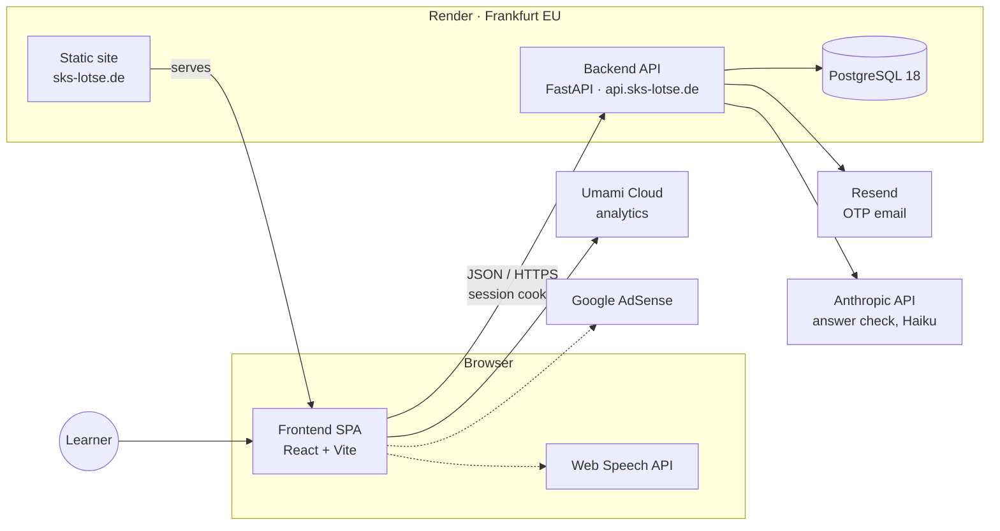

# Architecture

Current-state overview: what the product does, which parts the system consists of, how they relate, and where each responsibility lives. This document describes *what exists*. The reasons behind it are in the [ADRs](adr/) ([index](adr/README.md)), the rules for adding code are in `CLAUDE.md`, operating it is in the [runbook](RUNBOOK.md), the catalog import in [catalog-pipeline.md](catalog-pipeline.md), and behavioral detail is in the code and its tests.

## Product

The official SKS exam catalog is free text, not multiple choice: the learner writes an answer and judges it against the official model answer. SKS Lotse is web-only (no app store).

1. **Login is required** (email + one-time code; SSO is planned). Progress is always stored server-side against the account.
2. **Learning by topic** (`/learn`): a question, an optional scratchpad answer (never sent unless the learner asks for the AI check), then the official answer, and the learner grades themselves: Richtig / Teilweise Richtig / Falsch ([ADR-0023](adr/0023-self-assessed-learning-flow.md)).
3. **"Gelernt" is a half-life estimate, not a streak** ([ADR-0034](adr/0034-half-life-model-for-gelernt.md), [ADR-0039](adr/0039-cumulative-spacing-for-richtig-streaks.md)): each grading re-estimates the question's memory half-life. A question is gelernt while the half-life is ≥ 7 days and the estimated recall probability is ≥ 0.7, and it resurfaces once that decays. The UI never shows the numbers ([ADR-0024](adr/0024-course-gauge-without-visible-step-count.md)); the constants are in `backend/app/core/progress.py`.
4. **Lotsen-Check** ("Antwort vom Lotsen bewerten lassen", [ADR-0031](adr/0031-ai-answer-check-with-claude-haiku.md)): for accounts with `token_balance > 0`, Claude Haiku *suggests* a grade plus feedback (1 token per check, [ADR-0043](adr/0043-token-based-ai-grading-monetization.md)), and the learner still confirms. The token balance is the sole spending control ([ADR-0044](adr/0044-drop-weekly-ai-check-budget.md)), on top of the existing per-question/per-hour rate limits and prompt-injection hardening ([ADR-0040](adr/0040-ai-grading-sanitizer-and-abuse-monitoring.md)).
5. **Fokus topics** ([ADR-0028](adr/0028-focus-topics.md)): starred topics on `/learn`. The Fokus session (`/learn/focus`) runs all their not-yet-gelernt questions, the one whose last "Richtig" is longest ago first. A Fokus topic drops out for good once all its questions are learned.
6. **Prüfungssimulation** (`/exam`, [ADR-0029](adr/0029-exam-simulation.md)): a random Fragebogen (30 questions, 9/7/5/9 by subject group, 90 minutes enforced server-side, no tips), answered in full, then self-assessed question by question with the same Lotsen-Check. "Richtig" answers then count for the Lernstand ([ADR-0037](adr/0037-exam-richtig-answers-feed-the-lernstand.md)). History and statistics are on `/profile`. The Kartenaufgabe isn't simulated.
7. **Exam variant** is an account attribute (`users.exam_variant`: "Segeln und Motor" or "Motor"), settable on `/learn` and `/profile`. Question lists are filtered to its subjects unless a subject is requested explicitly.
8. **Profile** (`/profile`): optional name and gender (the name then replaces the email wherever the learner's own identity is shown), exam variant, Lernstand and exam statistics, email change (a code to the *new* address confirms it; purpose-bound, so it never works as a login code), and self-service account deletion.
9. **Feedback** ([ADR-0030](adr/0030-question-reports-and-feedback-channels.md)): a `mailto:` link ("Feedback" in the logged-in header's menu, "Kontakt" in the footer), "Frage melden" under every question (counted in the daily KPI report; the comments are read via the Render Shell), and coarse Umami funnel events (fixed keys only, never free text).

**Monetization** is freemium with two independent add-ons ([ADR-0006](adr/0006-mandatory-login-and-feature-gated-monetization.md)): remove ads once for a one-time fee (`users.ads_removed`) and pay-per-use tokens for the Lotsen-Check (`users.token_balance`, [ADR-0043](adr/0043-token-based-ai-grading-monetization.md)). All four ads/no-ads × has-tokens/no-tokens combinations are valid. Prices are fixed and operator-editable (`GET /api/v1/pricing`, public; `/admin/settings`), but there is no payment provider yet: the operator credits tokens/Werbefrei by hand on `/admin`, and the frontend shows the prices only as a "bald verfügbar" teaser.

**Operator tools** (`/admin`, gated by the `ADMIN_EMAILS` allowlist, [ADR-0019](adr/0019-admin-allowlist-and-manual-gdpr-fulfillment.md), plus a TOTP second factor from an authenticator app, [ADR-0047](adr/0047-totp-step-up-for-admin-area.md)): browse and search the accounts (email or name), open one to export its data as JSON, delete it or credit tokens/Werbefrei by hand, block or unblock its login with one click, manage a manual email/domain blocklist for spam/abuse ([ADR-0045](adr/0045-manual-email-domain-blocklist.md)), look up question and official-answer texts across the catalog. KPIs arrive as the daily report mail ([ADR-0032](adr/0032-daily-kpi-report.md)), not on `/admin`. The pages share one layout with a tab per section (`components/AdminLayout.tsx`). Data-subject requests are fulfilled by hand with these ([runbook](RUNBOOK.md#data-subject-requests-dsgvo)).

## System context

Dotted lines are planned and not built yet (see [Not yet built](#not-yet-built)). All runtime services run in the EU, except the Anthropic API (US, see ADR-0031). Render sits behind Cloudflare, which matters for client-IP detection ([ADR-0007](adr/0007-in-memory-per-ip-rate-limiting.md)).

Dev-time only, not part of the runtime: GitHub Actions (CI), Aikido (security scanning of the repo, rescans about every three days; alerts are handled right away, no merge gate) and a separate Anthropic API key for the offline topic classification of the catalog (see [Question catalog](#question-catalog)).

## Components

### Frontend (`frontend/`)
A static single-page app: React + TypeScript, Vite, Zustand, Tailwind ([ADR-0013](adr/0013-frontend-architecture-and-tooling.md)), served by a Render static site ([ADR-0015](adr/0015-frontend-deployment-topology.md)).

- **Prerendered public pages**: `npm run build` renders `/`, `/faq`, `/imprint`, `/privacy`, `/terms` and `/exam-process` to static HTML (`dist/index.html`, `faq.html`, …) so crawlers see its content; the client hydrates it. Each of these but `/` also gets its own `<title>`/description/OG/Twitter/canonical, generated in `prerender.mjs`. Every other route gets the empty shell (`dist/app.html`) via the SPA fallback ([ADR-0025](adr/0025-build-time-prerender-of-the-landing-page.md)).
- **Routing**: public pages (landing, login, legal) and protected pages (start, learn, practice, exam simulation, profile, admin) behind `ProtectedRoute`. The admin pages are nested routes under `AdminLayout`, which does the admin check once and, before any admin page, the 2FA setup or code prompt (`components/AdminMfa.tsx`).
- **Auth state**: never reads the session token. "Logged in" is derived from `GET /auth/me` ([ADR-0012](adr/0012-httponly-cookie-for-frontend-session-token.md)).
- **API access**: one thin typed `fetch` wrapper (`src/api/client.ts`). The response types are generated from the backend's OpenAPI schema (`src/api/schema.gen.ts`, [ADR-0046](adr/0046-api-types-generated-from-openapi.md)); `src/api/types.ts` only narrows the literal-valued fields. It always sends credentials and treats any `401` as "session gone". A failed `/auth/me` check that isn't a `401` (network, 5xx) is not a logout: `ProtectedRoute` offers a retry instead of redirecting to `/login`.
- **Loading data**: screens load through `useApiQuery` (`src/hooks/useApiQuery.ts`): once per key (route params, exam id), with a response for an outdated key dropped and "loading" shown again for a new one; `reload` refreshes in place after a write. Practice and the exam's self-assessment share the grading controls (`components/SelfAssessment.tsx`), and the practice loop itself is `components/PracticeRun.tsx`, used by the topic and the Fokus pages. Exam answers autosave one request at a time, so a slow older save can't overwrite a newer text.
- **Design system**: tokens in `src/index.css` ([ADR-0014](adr/0014-visual-design-system.md)), self-hosted fonts ([ADR-0021](adr/0021-self-hosted-web-fonts.md)), shared components in `src/components/` (`RichText` renders the catalog's chart notation, e.g. the drying height in Navigation 84, as markup), incl. the per-question progress gauge ([ADR-0024](adr/0024-course-gauge-without-visible-step-count.md)).
- **Ads**: only when `VITE_ADSENSE_CLIENT_ID` is set. The `adsense-snippet` plugin in `vite.config.ts` puts Google's AdSense script into the built HTML `<head>`, and `prerender.mjs` keeps it only on the prerendered public pages. In the app, `routes/AdScriptGate.tsx` loads it at runtime for accounts that see ads, never for ads-removed accounts or on `/admin`, and reloads a page out of a document that must not run it. `src/ads.ts` holds the logic. Consent comes from Google's own TCF consent management, re-openable via the footer's "Cookies" from any page (with a visible hint when Google's dialog can't be loaded) ([ADR-0027](adr/0027-adsense-with-google-consent-management.md), addendum 2026-09-23). No ad units are rendered yet.
- **Analytics**: cookieless Umami, only enabled when `VITE_UMAMI_WEBSITE_ID` is set ([ADR-0016](adr/0016-umami-cloud-analytics-without-consent-banner.md)); custom funnel events via `trackEvent`, coarse properties only ([ADR-0030](adr/0030-question-reports-and-feedback-channels.md)).
- **Catalog attribution**: the `/imprint` page credits ELWIS (Wasserstraßen- und Schifffahrtsverwaltung des Bundes) as the source of the official SKS question catalog. The catalog is an amtliches Werk under § 5 UrhG and copyright-free; ELWIS requires only a source citation (verified 2026-09-18).

### Backend (`backend/`)
One FastAPI deployable, organized as a modular monolith ([ADR-0002](adr/0002-modulith-over-microservices.md)):

| Layer | Role |
|---|---|
| `api/v1/` | HTTP routes, one module per area (below) |
| `services/` | Business logic the routes share: the cached catalog, OTP codes, exam read models, progress and the batched exam credit, the AI check and its quota, the admin export, user deletion, KPIs, email, catalog seeding |
| `models/`, `schemas/` | SQLAlchemy persistence, Pydantic request/response contracts |
| `core/` | Cross-cutting concerns: config, JWT/OTP, cache, middleware |

| Area | Responsibility | ADRs |
|---|---|---|
| `auth` | Login, session, own profile, email change, self-deletion | [0006](adr/0006-mandatory-login-and-feature-gated-monetization.md), [0008](adr/0008-token-version-based-logout.md), [0011](adr/0011-dev-only-otp-peek-endpoint-for-external-integration-tests.md), [0012](adr/0012-httponly-cookie-for-frontend-session-token.md) |
| `questions` | Read-only catalog (incl. the images of image questions) and topics, filtered by the learner's exam variant | [0009](adr/0009-in-process-cache-for-question-catalog.md), [0017](adr/0017-official-topic-taxonomy-and-seemannschaft-merge.md), [0033](adr/0033-catalog-images-as-static-files.md) |
| `progress` | Per-topic learning status (sicher/teilweise gelernt), per-question memory half-lives ("gelernt" while recall probability is high), recording a self-assessed grading, marking topics as Fokus, the Fokus session's ordered question list (`GET /progress/focus/questions`) | [0018](adr/0018-learning-progress-model-and-gelernt-streak-rule.md), [0034](adr/0034-half-life-model-for-gelernt.md), [0023](adr/0023-self-assessed-learning-flow.md), [0028](adr/0028-focus-topics.md) |
| `grading` | The Lotsen-Check (`POST /questions/{id}/ai-grade`): 1 token per check, per-question/day and per-hour caps, a process-wide cap on concurrent LLM calls, the sanitizer | [0031](adr/0031-ai-answer-check-with-claude-haiku.md), [0040](adr/0040-ai-grading-sanitizer-and-abuse-monitoring.md), [0043](adr/0043-token-based-ai-grading-monetization.md), [0044](adr/0044-drop-weekly-ai-check-budget.md) |
| `pricing` | Public, unauthenticated teaser prices (`GET /pricing`) for the landing page and in-app upsell; no purchase flow yet | [0043](adr/0043-token-based-ai-grading-monetization.md) |
| `question_reports` (in `questions`) | "Frage melden": learners flag faulty catalog questions; the daily KPI report lists the most-reported ones, the comments are read via the Render Shell ([runbook](RUNBOOK.md#daily-kpi-report)) and are part of the reporter's DSGVO export | [0030](adr/0030-question-reports-and-feedback-channels.md) |
| `exams` | Exam simulation (Fragebogen): start with a random draw, autosaved answers, server-enforced deadline, self-assessment ("Richtig" answers feed the Lernstand once the exam is complete), history and statistics | [0029](adr/0029-exam-simulation.md), [0037](adr/0037-exam-richtig-answers-feed-the-lernstand.md) |
| `admin` | User list with search (`GET /admin/users`), GDPR lookup/export/delete, question-text search over the cached catalog (`GET /admin/questions`), every price/package (app-wide defaults in `app_settings` via `/admin/settings`), granting tokens/Werbefrei by hand (`PATCH /admin/users/{id}`), read-only AI-grading abuse signal (`ai_flags_count`), a manual email/domain blocklist for spam/abuse (`/admin/blocklist`, `POST`/`DELETE /admin/users/{id}/block`), allowlist-gated plus a recent TOTP check; the 2FA setup/step-up itself is `/admin/mfa/*` (allowlist only) | [0019](adr/0019-admin-allowlist-and-manual-gdpr-fulfillment.md), [0047](adr/0047-totp-step-up-for-admin-area.md), [0032](adr/0032-daily-kpi-report.md), [0040](adr/0040-ai-grading-sanitizer-and-abuse-monitoring.md), [0043](adr/0043-token-based-ai-grading-monetization.md), [0045](adr/0045-manual-email-domain-blocklist.md) |

Every request passes through a middleware stack: a request id for the logs (`X-Request-ID`), redirect of secondary domains to `sks-lotse.de`, a manual maintenance-mode kill switch that can block all of `/api/v1` (see [Deployment](#deployment) below), per-IP rate limiting for `/api/v1` ([ADR-0007](adr/0007-in-memory-per-ip-rate-limiting.md)), security headers, and CORS. Per-process state (rate-limit counters, catalog cache, maintenance throttles) sits behind `core/cache.py`. That interface could later move to a shared store without its callers changing ([ADR-0009](adr/0009-in-process-cache-for-question-catalog.md), [ADR-0010](adr/0010-opportunistic-otp-code-cleanup.md)).

API docs (Swagger/ReDoc/OpenAPI) and other dev tooling are only exposed when `ENVIRONMENT` is `development` or `test`.

### Auth
- **Login**: passwordless email + one-time code. SSO is not built yet. Codes are hashed, short-lived and bound to a purpose (login vs. email change). A code for one purpose never works for the other.
- **Session**: a successful login issues a JWT in an httpOnly cookie. Non-browser clients (Postman, integration tests) can send the same token as a Bearer header instead. There is no refresh token. The token must carry `exp`, `sub` and `tv`. Logout invalidates all of a user's tokens by bumping a per-user `token_version` — that is also how a learner evicts a session someone else holds.
- **Access**: every `/api/v1` route requires the JWT, except requesting and verifying a login code. `/health` is open and checks database connectivity (`503` when the database is unreachable). Admin routes additionally require the email to be in `ADMIN_EMAILS` and a session whose `mfa` claim (the time of its last TOTP check, `POST /admin/mfa/verify`) is at most `ADMIN_MFA_MAX_AGE_MINUTES` (12 h) old; otherwise they answer 403 `mfa_required`. The TOTP secret is stored Fernet-encrypted, with a key derived from `JWT_SECRET`; a lost authenticator is reset by the "Reset admin 2FA" GitHub Action ([ADR-0047](adr/0047-totp-step-up-for-admin-area.md), [runbook](RUNBOOK.md#reset-an-admins-2fa)).
- **AGB acceptance**: every login stamps `users.last_login_at`. Consent to the AGB currently in force (`users.agb_accepted_version`/`agb_accepted_at`, set only by `POST /auth/me/agb-accept`) is asked for once per version, not on every login: the frontend's `AgbGate` blocks the protected routes with a confirmation screen only when the account's stored version doesn't match the current one ([ADR-0041](adr/0041-agb-acceptance-and-inactivity-retention.md)).
- **Error contract**: `401` always means "no valid session", and the client logs out on it. Failures inside an authenticated flow (e.g. a wrong email-change code) therefore use other status codes.
- **Abuse protection** is layered:
  - the per-IP limiter, with tighter rules for requesting and verifying a code;
  - per-email quotas on code requests, plus a per-user quota on email changes;
  - blocking of disposable email domains;
  - a manual email/domain blocklist, checked on requesting and on verifying a code ([ADR-0045](adr/0045-manual-email-domain-blocklist.md));
  - an optional `ALLOWED_EMAILS` allowlist for the private beta.

  Anonymous endpoints answer uniformly, so they don't reveal which addresses exist.

### Data
PostgreSQL 18, with the schema managed by Alembic (`backend/alembic/versions/`).

| Table | Kind | Written by |
|---|---|---|
| `questions`, `topics` | Reference data, read-only at runtime | The catalog-seed data migrations, by upsert so ids and progress survive ([ADR-0022](adr/0022-catalog-sync-by-upsert.md)) |
| `users` | Account and profile, `ads_removed` and the token balance ([ADR-0043](adr/0043-token-based-ai-grading-monetization.md)), the sanitizer flag count, AGB acceptance version/timestamp, last-login timestamp ([ADR-0041](adr/0041-agb-acceptance-and-inactivity-retention.md)), an admin's encrypted TOTP secret ([ADR-0047](adr/0047-totp-step-up-for-admin-area.md)) | Auth and admin flows, the AI check |
| `purchases` | Ledger of every token/Werbefrei grant and the signup bonus (product, amount, who granted it) | Signup, admin token grants; a money-backed row is anonymized rather than deleted on account deletion ([ADR-0043](adr/0043-token-based-ai-grading-monetization.md)) |
| `app_settings` | Operator-tuned app-wide values (every token-package/Werbefrei price) | `/admin/settings` ([ADR-0043](adr/0043-token-based-ai-grading-monetization.md)) |
| `blocked_emails` | Manually blocked addresses/domains for spam and abuse | `/admin/blocklist`, `/admin/users/{id}/block` ([ADR-0045](adr/0045-manual-email-domain-blocklist.md)) |
| `question_progress` | Per-user, per-question memory half-life, last grading, last "Richtig", start of the current "Richtig" streak ([ADR-0039](adr/0039-cumulative-spacing-for-richtig-streaks.md)) and resurface time | The learner's self-assessment after each question ([ADR-0023](adr/0023-self-assessed-learning-flow.md)) |
| `focus_topics` | Per-user topics marked as Fokus | `PUT`/`DELETE /progress/focus/...`; deleted automatically once every question of the topic is learned ([ADR-0028](adr/0028-focus-topics.md)) |
| `question_reports` | Per-user reports of faulty questions (category + optional comment) | `POST /questions/{id}/report`; deleted with the account ([ADR-0030](adr/0030-question-reports-and-feedback-channels.md)) |
| `exam_attempts`, `exam_attempt_questions` | Per-user exam simulation runs: the drawn questions, the learner's answers and self-assessment | `/exams` endpoints; deleted with the account or one by one ([ADR-0029](adr/0029-exam-simulation.md)) |
| `otp_codes` | Transient | Login and email change; old rows are cleaned up opportunistically ([ADR-0010](adr/0010-opportunistic-otp-code-cleanup.md)) |

Deleting a user (self-service or admin) goes through one service function, `services/user.py`, so both paths remove the same data: progress, Fokus marks, question reports, exams and pending codes, then the account. Money-backed `purchases` rows are anonymized instead of deleted (statutory bookkeeping retention, [ADR-0043](adr/0043-token-based-ai-grading-monetization.md)).

### Payments
Token packages are bought through Stripe Hosted Checkout ([ADR-0048](adr/0048-stripe-hosted-checkout-with-webhook-fulfilment.md)), behind the `STRIPE_CHECKOUT` flag (`off` | `admins` | `on`).

1. The learner ticks the withdrawal waiver on `/pricing`; `POST /payments/checkout` (JWT, flag-gated, 403 otherwise) opens a Checkout Session with the price from `app_settings` sent inline as `price_data` and returns the Stripe URL; the SPA redirects there.
2. Stripe calls `POST /payments/webhook` (open route, authenticated by the `Stripe-Signature` header, independent of the flag). For a paid session (`checkout.session.completed` / `async_payment_succeeded`) `services/payments.py` books `token_wallet.grant(..., granted_by="stripe", stripe_payment_intent_id=…)`, once per Payment Intent (lookup plus unique index).
   After the credit, a background task mails the learner the purchase confirmation (contract data, the withdrawal waiver, link to the AGB) through Resend, the confirmation on a durable medium that § 312f/§ 356 Abs. 5 BGB require; a failed send is logged and never undoes the credit.
3. The success redirect (`/pricing?checkout=success&product=…`) credits nothing; the page marks the bought package and re-checks the session, once more after a delay, because the webhook may arrive later.

`UserRead.can_buy_tokens` tells the SPA whether to show the buy button; `PublicPricing.checkout_enabled` (only `on`) lets logged-out visitors see "Anmelden zum Kaufen".

### Question catalog
The official catalog PDF becomes database rows in two phases:

1. **Offline, on a developer machine.** Scripts parse the PDF and propose Seemannschaft I/II merges (text similarity) and topic assignments (LLM). A human then reviews the proposals, which are committed as YAML fixtures. The LLM only picks from the topics transcribed from the catalog's own table of contents, never invents new ones ([ADR-0017](adr/0017-official-topic-taxonomy-and-seemannschaft-merge.md), [ADR-0020](adr/0020-merge-sparse-topics-into-collective-groups.md)).
2. **Every deploy.** An Alembic data migration builds the catalog from the PDF plus those committed fixtures. No external calls are made, so every environment ends up with the same catalog and nobody has to remember a manual import step.

The details (subjects, the Seemannschaft merge, images, the three stages and how to change the catalog) are in [catalog-pipeline.md](catalog-pipeline.md).

### Deployment
Everything is declared in `render.yaml`:

- **Services**: a backend web service, a frontend static site, a managed Postgres and a daily Cron Job that mails the KPI report ([ADR-0032](adr/0032-daily-kpi-report.md)). All run in Frankfurt, and there is only a production environment ([ADR-0005](adr/0005-render-deployment-topology.md), [ADR-0015](adr/0015-frontend-deployment-topology.md)).
- **Deploys**: a push to `main` deploys once its GitHub checks have passed (`autoDeployTrigger: checksPass`). The backend migrates in a pre-deploy step (a failed migration aborts the deploy, the old instance keeps serving), runs exactly one uvicorn worker (the in-process limiter and cache assume a single process) and only receives traffic once `/health` passes.
- **Monitoring**: Better Stack checks availability of the website and `/health` and hosts the public status page at [sks-lotse.betteruptime.com](https://sks-lotse.betteruptime.com) (configured in the Better Stack dashboard, not in this repo).
- **Logs**: the backend and the cron job write one JSON object per line (`LOG_FORMAT=json`, `backend/app/core/log_config.py`). Render's log stream forwards them to Better Stack via syslog-ng. Every line logged during a request carries its `request_id`, which the response also returns as `X-Request-ID`. An unhandled exception becomes a single `level=ERROR` record with its traceback. Error alerts match on those fields. The daily-report cron pings a Better Stack heartbeat after a fully successful run, so a failed or skipped run alerts as well.
- **Security headers**: the frontend's come from `render.yaml` (an enforced CSP including the full script/connect allowlist, [ADR-0027](adr/0027-adsense-with-google-consent-management.md) addendum; hashed `/assets/*` are cached as immutable), the backend's from middleware.
- **Maintenance mode**: a `MAINTENANCE_MODE` env var, toggled only from outside the app (Render dashboard, or a manual GitHub Action calling Render's API) — never `/admin`, which may be affected by the same malfunction. While on, the backend blocks all of `/api/v1` except `/health` and the frontend shows a full-page notice except on the legal pages ([ADR-0042](adr/0042-manual-maintenance-mode.md), operating steps in the [runbook](RUNBOOK.md#maintenance-mode)).

| Domain | Served by |
|---|---|
| `sks-lotse.de`, `www.` | Frontend (canonical) |
| `api.sks-lotse.de` | Backend API |
| `sks-lotse.com`, `www.` | Backend, which 301-redirects to `sks-lotse.de` |

`sks-lotse.global` and `sks-lotse.store` are registered but unused. How to operate all of this (logs, rollback, backups, secrets, DSGVO requests) is in the [runbook](RUNBOOK.md).

### Quality gates
GitHub Actions runs on every PR and every push to `main`:

- **Backend**: lint, unit tests with a 95% coverage gate, migrations against a real Postgres, black-box integration tests against a running server, and a freshness check of the generated Postman collection.
- **Frontend**: lint, type check, tests with a 95%/90% (lines/branches) coverage gate, and the production build including the prerender.
- **Mutation testing**: daily, not per PR (mutmut 87%, Stryker 90% minimum; [docs/mutation-testing.md](mutation-testing.md)).
- **Security**: Aikido rescans the repo about every three days — no CI job and no merge gate; an alert is triaged the same day ([docs/RUNBOOK.md](RUNBOOK.md) → Security alerts).

All of them except the integration tests are required status checks on `main`, and a PR must be up to date with `main` before it can merge. See `CLAUDE.md` → Branch Strategy for the exact rules and Development Conventions for how each check works.

## Not yet built

- Tips per question (text or image), and enforcing the rule that a revealed tip caps that attempt's grading to "Teilweise Richtig" ([ADR-0038](adr/0038-tip-reveal-caps-grading-outcome.md))
- SSO login (Google/Facebook/X)
- Paying for "Werbefrei": token packages are bought via Stripe ([Payments](#payments)), but `ads_removed` is still credited by hand on `/admin` ("bald verfügbar")
- Switching `STRIPE_CHECKOUT` to `on` for learners: needs the privacy policy, AGB and `CURRENT_AGB_VERSION` updated first ([runbook](RUNBOOK.md#stripe-checkout))
- Automatic grading of an entire exam in one go (the planned 25-token bulk price is fixed in [ADR-0043](adr/0043-token-based-ai-grading-monetization.md), but the feature itself isn't built — exams are still self-assessed only)
- Speech-to-text (Web Speech API)
- Ad units: none are rendered yet. The AdSense script and the consent management are in ([ADR-0027](adr/0027-adsense-with-google-consent-management.md))
- Automatic deletion of accounts inactive for 12+ months: the AGB reserve this right and `users.last_login_at` exists for it, but there is no cron job or reminder email yet ([ADR-0041](adr/0041-agb-acceptance-and-inactivity-retention.md))

This section should shrink as each piece lands. Keep it accurate rather than aspirational.
