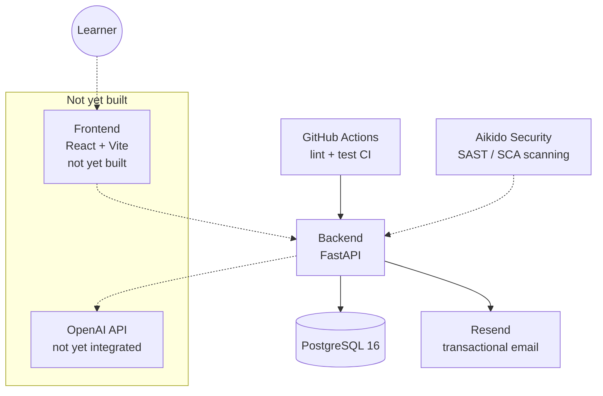

# Architecture

Current-state overview. For the reasoning behind a given decision, see [docs/adr/](adr/) — this document describes *what exists*, ADRs describe *why*.

## System overview

Dotted lines: not yet implemented, or scans the repo rather than calling it at runtime.

## Components

### Backend (`backend/`)
FastAPI app, Python 3.12. SQLAlchemy models, Alembic migrations. Exposes read-only endpoints for the question catalog (`/api/v1/questions`, login required), auth endpoints (`/api/v1/auth`, see below), and a health check (`/health`, unauthenticated). See [docs/adr/0001-use-architecture-decision-records.md](adr/0001-use-architecture-decision-records.md) onward for specific decisions as they're made.

Swagger UI, ReDoc, and the raw `/openapi.json` schema are only served when `ENVIRONMENT` (`backend/app/core/config.py`) isn't `production` — enabled by default (local dev, CI, the Postman-regeneration script), disabled on Render via `render.yaml`.

### Auth (`backend/app/api/v1/auth.py`)
Email+OTP login, implementing the login half of [docs/adr/0006](adr/0006-mandatory-login-and-feature-gated-monetization.md) (SSO providers not built yet). `POST /api/v1/auth/otp/request` emails a 6-digit code via Resend (`backend/app/services/email.py`); `POST /api/v1/auth/otp/verify` checks it against the hashed, short-lived code stored in `otp_codes`, gets-or-creates the matching `users` row, and issues a JWT (`backend/app/core/jwt.py`, HS256, 7-day expiry, no refresh token yet). Every other `/api/v1/*` route requires that JWT (`Depends(get_current_user)`, e.g. `GET /api/v1/auth/me` and all of `/api/v1/questions`) — `otp/request` and `otp/verify` are the only two routes that stay open, since that's how a caller gets a token in the first place. This replaced a temporary `X-Access-Key` gate that used to sit in front of the whole API before real auth existed.

`POST /api/v1/auth/logout` (authenticated) ends a session early instead of waiting out the full 7-day TTL: each `User` carries a `token_version` counter, every issued token embeds the version it was minted with, and `get_current_user` rejects a token whose embedded version no longer matches — logout just increments the counter. See [ADR-0008](adr/0008-token-version-based-logout.md) for why this beat a blacklist table or a refresh-token flow.

`ALLOWED_EMAILS` (`backend/app/core/config.py`, `Settings.allowed_emails_set`) is an optional comma-separated email allowlist for a pre-launch/private beta — unset by default (open to all). When set, `otp/request` silently no-ops for any other address, same generic response as the cooldown/rate-limit cases, so it doesn't leak who's on the list. Independent of that, `otp/request` also always rejects known disposable/throwaway email domains (`backend/app/core/otp.py`, `is_disposable_email`, via the [disposable-email-domains](https://github.com/disposable-email-domains/disposable-email-domains) package) — redundant while the allowlist is active, but matters once it's lifted.

Abuse protection on `/auth/otp/request` is layered: a per-email cooldown + hourly cap (`backend/app/core/otp.py`) stops one inbox from being spammed, on top of a generic in-memory per-IP rate limiter (`backend/app/core/rate_limit.py`, wired in `main.py`) that also applies a generous blanket cap to the rest of `/api/v1`. The IP limiter is intentionally in-process, not Redis-backed, and there's no reverse proxy in front doing this instead — see [ADR-0007](adr/0007-in-memory-per-ip-rate-limiting.md) for why.

`otp_codes` rows are transient: `request_otp` deletes anything past its retention window as a side effect of issuing a new code, so the table doesn't grow unbounded — no scheduled job. See [ADR-0010](adr/0010-opportunistic-otp-code-cleanup.md).

### Caching (`backend/app/core/cache.py`)
A minimal in-process TTL cache (`get_or_set`/`invalidate`, state on `app.state`, same pattern as the rate limiter above). `backend/app/api/v1/questions.py` caches the whole question catalog for an hour, since it's read on every practice session but only ever changes via the offline import script. Local by design, behind an interface a Redis-backed implementation could later replace without touching callers — see [ADR-0009](adr/0009-in-process-cache-for-question-catalog.md).

### Database
PostgreSQL 16. Local dev via `docker-compose.yml` (repo root). Production: Render managed Postgres (Frankfurt EU) — see `CLAUDE.md` for connection details and env vars.

### Deployment
Render (Frankfurt EU), provisioned as code via `render.yaml` (repo root): one web service for the backend, one managed Postgres. No frontend service yet. No staging environment — production only. See [docs/adr/0005-render-deployment-topology.md](adr/0005-render-deployment-topology.md) for the reasoning.

`sks-lotse.de` is the canonical domain. `sks-lotse.com` is also wired to Render (free SSL) and 301-redirected to `sks-lotse.de` by `backend/app/core/canonical_domain.py`, instead of paying IONOS for SSL-enabled domain forwarding. `sks-lotse.global` and `sks-lotse.store` are purchased but not currently wired up. See `CLAUDE.md` → Naming / Domain.

### Catalog import
`backend/scripts/import_catalog.py` — one-off script, parses `docs/Fragenkatalog-SKS.pdf` into the `questions` table. Not a service; run manually when the catalog changes.

### CI/CD
GitHub Actions (`.github/workflows/backend-ci.yml`): separate `lint` (ruff) and `test` (pytest, 80% coverage gate) jobs on every push to `main` and every PR.

### Security scanning
Aikido Security, connected to the GitHub repo. See `CLAUDE.md` → Development Conventions → Security Scanning for the current process and `scripts/check_aikido.sh` for querying findings directly.

## Not yet built

- Frontend (React + Vite, per `CLAUDE.md` tech stack)
- LLM grading flow (OpenAI integration)
- SSO login (Google/Facebook/X) — email+OTP login exists, see Auth above
- Entitlements (ads-removed / AI-grading-unlocked flags on the account — see [docs/adr/0006](adr/0006-mandatory-login-and-feature-gated-monetization.md))
- Speech-to-text integration
- Ads (AdSense)

This section should shrink as each piece lands — keep it accurate rather than aspirational.
