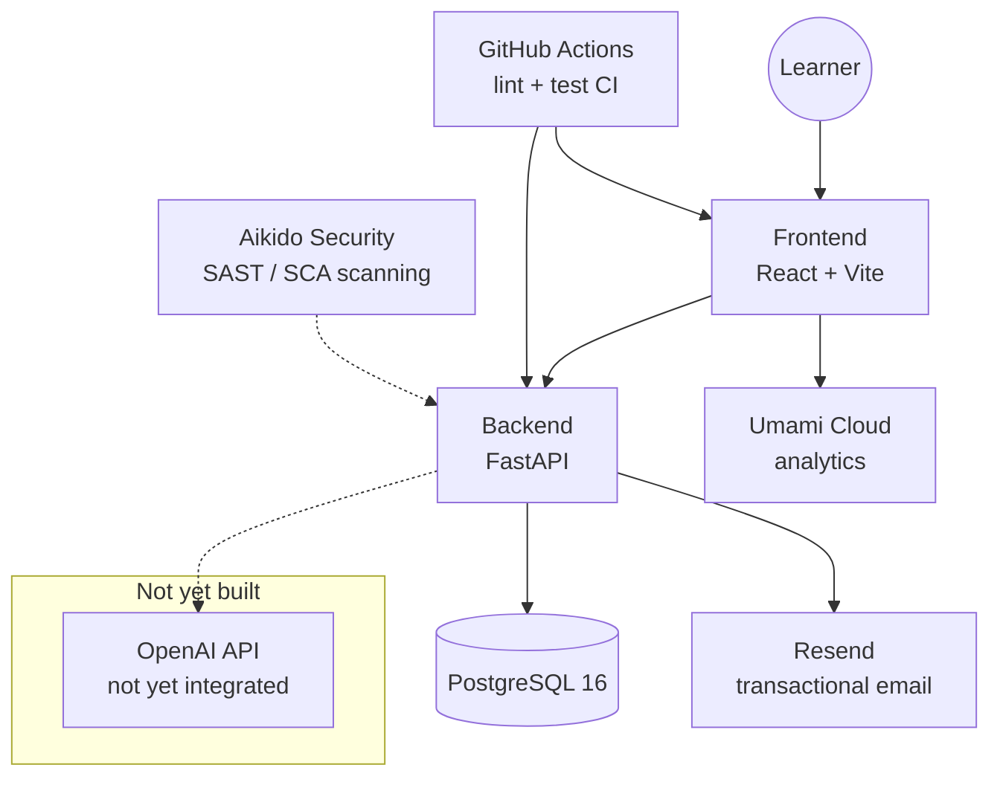

# Architecture

Current-state overview. For the reasoning behind a given decision, see [docs/adr/](adr/) — this document describes *what exists*, ADRs describe *why*.

## System overview

Dotted lines: not yet implemented, or scans the repo rather than calling it at runtime.

## Components

### Frontend (`frontend/`)
React (Vite) + TypeScript, per [ADR-0013](adr/0013-frontend-architecture-and-tooling.md); visual design tokens per [ADR-0014](adr/0014-visual-design-system.md). Routes so far: `/` (landing page), `/login` (two-step email+OTP form), `/start` (protected — greets the logged-in learner, links to `/learn`; a second placeholder nav tile for Prüfungssimulation still isn't interactive; shows an additional "Admin" link when `user.is_admin`), `/learn` (protected — a small header-area exam-variant dropdown, an aggregate "Gesamtfortschritt" tile, and a read-only per-topic "Lernstand" list, see [ADR-0018](adr/0018-learning-progress-model-and-gelernt-streak-rule.md); picking a topic doesn't lead anywhere yet), and `/admin` (protected, additionally gated on `user.is_admin` — look a user up by email, export their data as JSON, or delete their account; see Admin / GDPR tooling below and [ADR-0019](adr/0019-admin-allowlist-and-manual-gdpr-fulfillment.md)). Zustand (`src/store/authStore.ts`) holds the current user and derives "logged in" from a `GET /auth/me` call, never from inspecting a token — the frontend never reads the session cookie directly (ADR-0012). `src/api/client.ts` is the thin typed `fetch` wrapper named in ADR-0013: always `credentials: "include"`, and a uniform 401 handler that clears the auth store. `src/routes/ProtectedRoute.tsx` redirects to `/login` when not authenticated.

Question list/answering, grading, and ads are not built — they depend on backend pieces that don't exist yet (see Not yet built). A learning-progress data model and a read-only Lernstand overview now exist (see `/learn` above and ADR-0018); actually answering a question and having it graded does not.

Also serves `/imprint` and `/privacy` — static legal pages, reachable logged-out, linked from a `LegalFooter` on every page.

Brand identity (`src/components/Logo.tsx`, `Header.tsx`): a logomark built from the ADR-0014 chart-tile/dog-ear motif plus a plotted course line and position-fix dot, first wired into the landing page's new `Header` and into `LegalFooter`. `frontend/public/` carries the matching favicon (`favicon.svg`, `.ico`, sized PNGs), `apple-touch-icon.png`, `site.webmanifest`, `og-image.png`, `robots.txt`, and `sitemap.xml`; `index.html` carries the matching meta description, canonical link, Open Graph/Twitter tags, and `WebApplication` JSON-LD — landing page only so far, not yet the other routes.

The landing page also carries the first real build of two more ADR-0014 patterns: `AdSlot` (the dashed-border ad placeholder, used in the free-tier pricing card — same component is meant for Start/Fragenliste/Frage beantworten/Bewertung once those exist) and a decorative `ContourBackground` (the "faint bathymetric contour-line texture" from that ADR's concept section, behind the hero). `ChartTile` gained an optional `icon` slot, used by a new "So funktioniert's" section. `ContourBackground` also sits behind the top banner of every other page (`/login`, `/start`, `/imprint`, `/privacy`) for a consistent brand feel — each wrapped in a `relative overflow-hidden` container sized to its own header so the graphic stays clipped to that banner and never bleeds into the content below.

### Analytics
Umami Cloud (Hobby plan), loaded by `frontend/src/analytics.ts` (`initAnalytics()`, called once from `main.tsx`), gated on `VITE_UMAMI_WEBSITE_ID` being set — unset in local dev/CI, so no dev/test traffic is tracked. Cookieless (no persistent identifier, no cross-session tracking), so no consent banner is needed — see [ADR-0016](adr/0016-umami-cloud-analytics-without-consent-banner.md).

### Backend (`backend/`)
FastAPI app, Python 3.12. SQLAlchemy models, Alembic migrations. Exposes read-only endpoints for the question catalog (`/api/v1/questions` and `/api/v1/topics`, login required), a per-topic learning-progress summary (`/api/v1/progress/summary`, see below and [ADR-0018](adr/0018-learning-progress-model-and-gelernt-streak-rule.md)), auth endpoints (`/api/v1/auth`, see below), GDPR admin tooling (`/api/v1/admin`, see below), and a health check (`/health`, unauthenticated). See [docs/adr/0001-use-architecture-decision-records.md](adr/0001-use-architecture-decision-records.md) onward for specific decisions as they're made.

Swagger UI, ReDoc, and the raw `/openapi.json` schema are only served when `ENVIRONMENT` (`backend/app/core/config.py`, one of `development`/`test`/`production` — anything else fails at startup) is `development` or `test` (`Settings.exposes_dev_tooling`) — enabled by default (local dev, CI, the Postman-regeneration script), disabled on Render via `render.yaml`.

### Auth (`backend/app/api/v1/auth.py`)
Email+OTP login, implementing the login half of [docs/adr/0006](adr/0006-mandatory-login-and-feature-gated-monetization.md) (SSO providers not built yet). `POST /api/v1/auth/otp/request` emails a 6-digit code via Resend (`backend/app/services/email.py`); `POST /api/v1/auth/otp/verify` checks it against the hashed, short-lived code stored in `otp_codes`, gets-or-creates the matching `users` row, and issues a JWT (`backend/app/core/jwt.py`, HS256, 7-day expiry, no refresh token yet). The token is set as an httpOnly, `SameSite=Lax` cookie (`Secure` in production only — see [ADR-0012](adr/0012-httponly-cookie-for-frontend-session-token.md)), which is what the frontend uses; it's also still returned in the response body as a Bearer token for Postman/the integration-test suite/any future non-browser client, and `get_current_user` accepts either, cookie first. Every other `/api/v1/*` route requires that JWT (`Depends(get_current_user)`, e.g. `GET /api/v1/auth/me` and all of `/api/v1/questions`) — `otp/request` and `otp/verify` are the only two routes that stay open, since that's how a caller gets a token in the first place. This replaced a temporary `X-Access-Key` gate that used to sit in front of the whole API before real auth existed.

`PATCH /api/v1/auth/me` lets the learner set `exam_variant` (`"motor"` | `"segeln_und_motor"`) on their own account — the only per-account preference field so far, used by `/api/v1/questions` to default which subjects are returned (see Question Catalog in `CLAUDE.md`). No settings UI exists yet to call it from.

`POST /api/v1/auth/logout` (authenticated) ends a session early instead of waiting out the full 7-day TTL: each `User` carries a `token_version` counter, every issued token embeds the version it was minted with, and `get_current_user` rejects a token whose embedded version no longer matches — logout just increments the counter. See [ADR-0008](adr/0008-token-version-based-logout.md) for why this beat a blacklist table or a refresh-token flow.

`ALLOWED_EMAILS` (`backend/app/core/config.py`, `Settings.allowed_emails_set`) is an optional comma-separated email allowlist for a pre-launch/private beta — unset by default (open to all). When set, `otp/request` silently no-ops for any other address, same generic response as the cooldown/rate-limit cases, so it doesn't leak who's on the list. Independent of that, `otp/request` also always rejects known disposable/throwaway email domains (`backend/app/core/otp.py`, `is_disposable_email`, via the [disposable-email-domains](https://github.com/disposable-email-domains/disposable-email-domains) package) — redundant while the allowlist is active, but matters once it's lifted.

Abuse protection on `/auth/otp/request` is layered: a per-email cooldown + hourly cap (`backend/app/api/v1/auth.py`, on the lowercased address — `NormalizedEmail` in `backend/app/schemas/auth.py` — so case variants share one quota and one account) stops one inbox from being spammed, on top of a generic in-memory per-IP rate limiter (`backend/app/core/rate_limit.py`, wired in `main.py`) that also applies a generous blanket cap to the rest of `/api/v1` — one shared bucket per IP across all those paths, not one per path. The IP limiter is intentionally in-process, not Redis-backed, and there's no reverse proxy in front doing this instead — see [ADR-0007](adr/0007-in-memory-per-ip-rate-limiting.md) for why.

`otp_codes` rows are transient: `request_otp` deletes anything past its retention window as a side effect of issuing a new code, so the table doesn't grow unbounded — no scheduled job. The delete itself is throttled to run at most once every `settings.otp_cleanup_min_interval_seconds`, so its cost doesn't scale with request volume under heavy traffic. See [ADR-0010](adr/0010-opportunistic-otp-code-cleanup.md).

`GET /api/v1/auth/otp/_dev-peek` returns the plaintext code last generated for an email — dev/test-only (404s and is never populated unless `ENVIRONMENT` is `development`/`test`, excluded from the OpenAPI schema), so an external Postman/Newman run can complete the OTP round-trip without a real inbox. See [ADR-0011](adr/0011-dev-only-otp-peek-endpoint-for-external-integration-tests.md).

### Learning progress (`backend/app/api/v1/progress.py`)
`GET /api/v1/progress/summary` returns, per topic and scoped to the caller's `exam_variant` the same way `GET /questions` already is, a total question count and a learned-question count (`correct_streak >= 3`, computed via `backend/app/core/progress.py`'s `is_learned()`, not stored). Backs the `/learn` page's read-only Lernstand overview. The `question_progress` table it reads from (one row per user+question, `correct_streak`) has no write path yet — nothing grades an answer yet — so every count is currently a genuine zero, not a UI placeholder; it'll reflect real progress once the grading feature starts writing to it. See [ADR-0018](adr/0018-learning-progress-model-and-gelernt-streak-rule.md).

### Admin / GDPR tooling (`backend/app/api/v1/admin.py`)
`/api/v1/admin/*` fulfills the DSGVO Art. 15/17/20 rights promised in the frontend's `/privacy` page: `POST /users/search` looks a user up by email, `GET /users/{id}/export` returns their data (account fields + `question_progress`, denormalized with subject/number — no question/answer text) as JSON, `DELETE /users/{id}` deletes the account (and explicitly deletes its `question_progress` rows first — not relying on the DB `ondelete="CASCADE"`, which only fires reliably on Postgres, not on the SQLite engine the test suite uses). Gated by `require_admin` (`backend/app/core/jwt.py`): valid JWT, then the caller's email must be in the `ADMIN_EMAILS` allowlist (`Settings.admin_emails_set`) — unlike `ALLOWED_EMAILS`, empty/unset means *no* admins, not open access. `GET /api/v1/auth/me` also reports a computed `is_admin` boolean (same allowlist check), which the frontend's `/admin` page and the "Admin" link on `/start` use to gate access — see [ADR-0019](adr/0019-admin-allowlist-and-manual-gdpr-fulfillment.md) for why this is an email allowlist rather than a DB role, and manual admin-driven fulfillment rather than user self-service.

### Caching (`backend/app/core/cache.py`)
A minimal in-process TTL cache (`get_or_set`/`invalidate`, state on `app.state`, same pattern as the rate limiter above). `backend/app/api/v1/questions.py` caches the whole question catalog for an hour, since it's read on every practice session but only ever changes via the offline catalog-import pipeline (see Catalog import below). Local by design, behind an interface a Redis-backed implementation could later replace without touching callers — see [ADR-0009](adr/0009-in-process-cache-for-question-catalog.md).

The same module also exposes `throttle`, built on the same `get_or_set` primitive but for gating opportunistic maintenance work (like the `otp_codes` cleanup above) to a bounded cadence instead of running it on every triggering request — see ADR-0010.

### Database
PostgreSQL 16. Local dev via `docker-compose.yml` (repo root). Production: Render managed Postgres (Frankfurt EU), wired to the backend via `DATABASE_URL` in `render.yaml`. Tables: `questions`, `topics`, `question_progress`, `users`, `otp_codes` (schema history in `backend/alembic/versions/`).

### Deployment
Render (Frankfurt EU), provisioned as code via `render.yaml` (repo root): one web service for the backend, one static-site web service for the frontend, one managed Postgres. No staging environment — production only. Migrations run in the `startCommand` before uvicorn starts; Render routes traffic to a new deploy once `/health` returns 2xx (`healthCheckPath`). See [docs/adr/0005-render-deployment-topology.md](adr/0005-render-deployment-topology.md) for the reasoning.

`sks-lotse.de` is the canonical domain. `sks-lotse.com` is also wired to Render (free SSL) and 301-redirected to `sks-lotse.de` by `backend/app/core/canonical_domain.py`, instead of paying IONOS for SSL-enabled domain forwarding. `sks-lotse.global` and `sks-lotse.store` are purchased but not currently wired up. See `CLAUDE.md` → Naming / Domain.

### Catalog import
`backend/app/services/catalog_seed.py` (`seed_catalog()`) parses `docs/Fragenkatalog-SKS.pdf`, collapses the near-duplicate Seemannschaft I/II questions into 3 subjects, and classifies every question against the catalog's topic list (`scripts/data/topics.yaml`, 25 topics — some named verbatim from the official table of contents, some merged/split collective groupings sized to 10-35 questions each, see [ADR-0020](adr/0020-merge-sparse-topics-into-collective-groups.md)) — all from committed source files, no external calls. It runs as an Alembic **data migration**, so `alembic upgrade head` seeds/rebuilds the full catalog automatically in every environment, including Render's `startCommand` before every deploy — not a manual step anyone has to remember. `backend/scripts/import_catalog.py`/`merge_seemannschaft.py`/`manage_topics.py` are thin CLI wrappers around the same functions, useful for local iteration; only `merge_seemannschaft.py propose` (text-similarity, no LLM) and `manage_topics.py propose` (calls the Anthropic API, `ANTHROPIC_API_KEY`, local dev-tooling only — separate from the `OPENAI_API_KEY` planned for the grading feature) ever touch anything outside the DB, and only to produce the human-reviewed YAML fixtures the migration then applies. Chart/diagram images referenced by a few questions aren't extracted (`image_ref` is always null). See `CLAUDE.md` → Question Catalog and [ADR-0017](adr/0017-official-topic-taxonomy-and-seemannschaft-merge.md) for the full reasoning.

### CI/CD
GitHub Actions. `.github/workflows/backend-ci.yml`: separate `lint` (ruff), `test` (pytest on SQLite, 80% line+branch coverage gate), `migrations` (Alembic upgrade/check/downgrade against a Postgres 16 service), and `postman-collection` (regenerates the API-reference Postman collection from the live OpenAPI schema, fails if the committed one is stale) jobs. `.github/workflows/frontend-ci.yml`: `lint` (ESLint + Prettier check) and `test` (`tsc -b` + Vitest, same 80% line+branch coverage gate). Both run on every push to `main` and every PR.

### External integration tests
`postman/integration-tests.postman_collection.json` (see `CLAUDE.md` → Integration Tests) — a separate, hand-written Postman collection that black-box tests a real, locally running backend over HTTP: auth guards, CORS, security headers, the full OTP login round-trip via `GET /api/v1/auth/otp/_dev-peek` (dev/test-only, see [ADR-0011](adr/0011-dev-only-otp-peek-endpoint-for-external-integration-tests.md)), and rate limiting. Runnable without a Python environment via `./scripts/run_integration_tests.sh` (Newman, over `npx`). Not wired into CI yet — manual/on-demand. Unlike the API-reference collection above, it isn't generated from the OpenAPI schema, so nothing keeps it in sync automatically — it has to be updated by hand alongside `backend/tests/` whenever the behavior it covers changes.

### Security scanning
Aikido Security, connected to the GitHub repo. See `CLAUDE.md` → Development Conventions → Security Scanning for the current process and `scripts/check_aikido.sh` for querying findings directly.

## Not yet built

- Frontend question list/answering and grading UI (the "Lernen starten" button per topic on `/learn` is still inert — see Frontend above)
- LLM grading flow (OpenAI integration) — and with it, anything actually writing to `question_progress` (see Learning progress above)
- SSO login (Google/Facebook/X) — email+OTP login exists, see Auth above
- Entitlements (ads-removed / AI-grading-unlocked flags on the account — see [docs/adr/0006](adr/0006-mandatory-login-and-feature-gated-monetization.md))
- Speech-to-text integration
- Ads (AdSense)
- Question images (charts/diagrams from the catalog PDF — see Catalog import)

This section should shrink as each piece lands — keep it accurate rather than aspirational.
