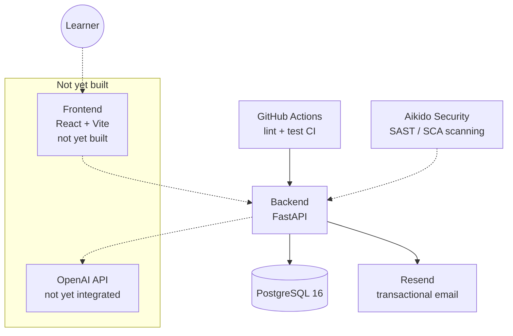

# Architecture

Current-state overview. For the reasoning behind a given decision, see [docs/adr/](adr/) — this document describes *what exists*, ADRs describe *why*.

## System overview

Dotted lines: not yet implemented, or scans the repo rather than calling it at runtime.

## Components

### Backend (`backend/`)
FastAPI app, Python 3.12. SQLAlchemy models, Alembic migrations. Exposes read-only endpoints for the question catalog (`/api/v1/questions`), auth endpoints (`/api/v1/auth`, see below), and a health check (`/health`). See [docs/adr/0001-use-architecture-decision-records.md](adr/0001-use-architecture-decision-records.md) onward for specific decisions as they're made.

### Auth (`backend/app/api/v1/auth.py`)
Email+OTP login, implementing the login half of [docs/adr/0006](adr/0006-mandatory-login-and-feature-gated-monetization.md) (SSO providers not built yet). `POST /api/v1/auth/otp/request` emails a 6-digit code via Resend (`backend/app/services/email.py`); `POST /api/v1/auth/otp/verify` checks it against the hashed, short-lived code stored in `otp_codes`, gets-or-creates the matching `users` row, and issues a JWT (`backend/app/core/jwt.py`, HS256, 30-day expiry, no refresh token yet). `GET /api/v1/auth/me` is the first JWT-protected route. This coexists with, rather than replaces, the temporary `X-Access-Key` gate below — the gate still restricts the whole API from outside access, while the JWT identifies *which* logged-in user is calling.

Abuse protection on `/auth/otp/request` is two-layered: a per-email cooldown + hourly cap (`backend/app/core/otp.py`) stops one inbox from being spammed, and a generic in-memory per-IP rate limiter (`backend/app/core/rate_limit.py`, wired in `main.py`) stops one caller from spraying requests across many different emails. The IP limiter is intentionally in-process, not Redis-backed — see its module docstring for why, given the current single-instance Render topology ([ADR-0005](adr/0005-render-deployment-topology.md)).

### Database
PostgreSQL 16. Local dev via `docker-compose.yml` (repo root). Production: Render managed Postgres (Frankfurt EU) — see `CLAUDE.md` for connection details and env vars.

### Deployment
Render (Frankfurt EU), provisioned as code via `render.yaml` (repo root): one web service for the backend, one managed Postgres. No frontend service yet. No staging environment — production only. See [docs/adr/0005-render-deployment-topology.md](adr/0005-render-deployment-topology.md) for the reasoning.

The deployed API currently sits behind a temporary `X-Access-Key` gate (`backend/app/core/security.py`) — not the planned JWT auth, just a stopgap while the app is live but not launched. See `CLAUDE.md` → Temporary Access Gate.

`sks-lotse.de` is the canonical domain. `sks-lotse.com` is also wired to Render (free SSL) and 301-redirected to `sks-lotse.de` by `backend/app/core/canonical_domain.py`, instead of paying IONOS for SSL-enabled domain forwarding. `sks-lotse.global` and `sks-lotse.store` are purchased but not currently wired up. See `CLAUDE.md` → Naming / Domain.

### Catalog import
`backend/scripts/import_catalog.py` — one-off script, parses `docs/Fragenkatalog-SKS.pdf` into the `questions` table. Not a service; run manually when the catalog changes.

### CI/CD
GitHub Actions (`.github/workflows/backend-ci.yml`): separate `lint` (ruff) and `test` (pytest, 80% coverage gate) jobs on every push to `main` and every PR.

### Security scanning
Aikido Security, connected to the GitHub repo. See `CLAUDE.md` → Development Conventions → Security Scanning for the current process and `scripts/check_aikido.sh` for querying findings directly.

## Not yet built

- Frontend (React + Vite, per `CLAUDE.md` tech stack)
- LLM grading flow (OpenAI integration)
- SSO login (Google/Facebook/X) — email+OTP login exists, see Auth above
- Entitlements (ads-removed / AI-grading-unlocked flags on the account — see [docs/adr/0006](adr/0006-mandatory-login-and-feature-gated-monetization.md))
- Speech-to-text integration
- Ads (AdSense)

This section should shrink as each piece lands — keep it accurate rather than aspirational.
