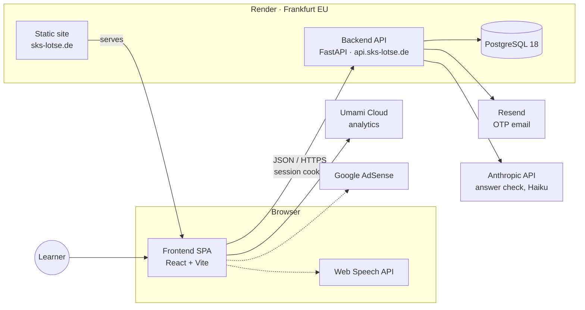

# Architecture

Current-state overview: which parts the system consists of, how they relate, and where each responsibility lives. This document describes *what exists*. The reasons behind it are in the [ADRs](adr/), the rules for adding code are in `CLAUDE.md`, and behavioral detail is in the code and its tests.

## System context

Dotted lines are planned and not built yet (see [Not yet built](#not-yet-built)). All runtime services run in the EU, except the Anthropic API (US, see ADR-0031). Render sits behind Cloudflare, which matters for client-IP detection ([ADR-0007](adr/0007-in-memory-per-ip-rate-limiting.md)).

Dev-time only, not part of the runtime: GitHub Actions (CI), Aikido (security scanning of the repo) and the Anthropic API when used offline for topic classification of the catalog (see [Question catalog](#question-catalog)); the runtime answer check also calls it ([ADR-0031](adr/0031-ai-answer-check-with-claude-haiku.md)).

## Components

### Frontend (`frontend/`)
A static single-page app: React + TypeScript, Vite, Zustand, Tailwind ([ADR-0013](adr/0013-frontend-architecture-and-tooling.md)), served by a Render static site ([ADR-0015](adr/0015-frontend-deployment-topology.md)).

- **Prerendered public pages**: `npm run build` renders `/`, `/faq`, `/imprint` and `/privacy` to static HTML (`dist/index.html`, `faq.html`, …) so crawlers see its content; the client hydrates it. Every other route gets the empty shell (`dist/app.html`) via the SPA fallback ([ADR-0025](adr/0025-build-time-prerender-of-the-landing-page.md)).
- **Routing**: public pages (landing, login, legal) and protected pages (start, learn, practice, exam simulation, profile, admin) behind `ProtectedRoute`.
- **Auth state**: never reads the session token. "Logged in" is derived from `GET /auth/me` ([ADR-0012](adr/0012-httponly-cookie-for-frontend-session-token.md)).
- **API access**: one thin typed `fetch` wrapper (`src/api/client.ts`). It always sends credentials and treats any `401` as "session gone". A failed `/auth/me` check that isn't a `401` (network, 5xx) is not a logout: `ProtectedRoute` offers a retry instead of redirecting to `/login`.
- **Design system**: tokens in `src/index.css` ([ADR-0014](adr/0014-visual-design-system.md)), self-hosted fonts ([ADR-0021](adr/0021-self-hosted-web-fonts.md)), shared components in `src/components/` (`RichText` renders the catalog's chart notation, e.g. the drying height in Navigation 84, as markup), incl. the per-question progress gauge ([ADR-0024](adr/0024-course-gauge-without-visible-step-count.md)).
- **Ads**: the `adsense-snippet` plugin in `vite.config.ts` puts Google's AdSense script into the built HTML `<head>` only when `VITE_ADSENSE_CLIENT_ID` is set (`src/ads.ts` holds the runtime helpers); consent comes from Google's own TCF consent management, re-openable via the footer's "Cookie-Einstellungen" ([ADR-0027](adr/0027-adsense-with-google-consent-management.md)). No ad units are rendered yet.
- **Analytics**: cookieless Umami, only enabled when `VITE_UMAMI_WEBSITE_ID` is set ([ADR-0016](adr/0016-umami-cloud-analytics-without-consent-banner.md)); custom funnel events via `trackEvent`, coarse properties only ([ADR-0030](adr/0030-question-reports-and-feedback-channels.md)).
- **Catalog attribution**: the `/imprint` page credits ELWIS (Wasserstraßen- und Schifffahrtsverwaltung des Bundes) as the source of the official SKS question catalog. The catalog is an amtliches Werk under § 5 UrhG and copyright-free; ELWIS requires only a source citation (verified 2026-09-18).

### Backend (`backend/`)
One FastAPI deployable, organized as a modular monolith ([ADR-0002](adr/0002-modulith-over-microservices.md)):

| Layer | Role |
|---|---|
| `api/v1/` | HTTP routes, one module per area (below) |
| `services/` | Business logic that spans routes, external integrations (email, catalog seeding, user deletion) |
| `models/`, `schemas/` | SQLAlchemy persistence, Pydantic request/response contracts |
| `core/` | Cross-cutting concerns: config, JWT/OTP, cache, middleware |

| Area | Responsibility | ADRs |
|---|---|---|
| `auth` | Login, session, own profile, email change, self-deletion | [0006](adr/0006-mandatory-login-and-feature-gated-monetization.md), [0008](adr/0008-token-version-based-logout.md), [0011](adr/0011-dev-only-otp-peek-endpoint-for-external-integration-tests.md), [0012](adr/0012-httponly-cookie-for-frontend-session-token.md) |
| `questions` | Read-only catalog (incl. the images of image questions) and topics, filtered by the learner's exam variant | [0009](adr/0009-in-process-cache-for-question-catalog.md), [0017](adr/0017-official-topic-taxonomy-and-seemannschaft-merge.md), [0033](adr/0033-catalog-images-as-static-files.md) |
| `progress` | Per-topic learning status (sicher/teilweise gelernt), per-question memory half-lives ("gelernt" while recall probability is high), recording a self-assessed grading, marking topics as Fokus, the Fokus session's ordered question list (`GET /progress/focus/questions`) | [0018](adr/0018-learning-progress-model-and-gelernt-streak-rule.md), [0034](adr/0034-half-life-model-for-gelernt.md), [0023](adr/0023-self-assessed-learning-flow.md), [0028](adr/0028-focus-topics.md) |
| `question_reports` (in `questions`) | "Frage melden": learners flag faulty catalog questions; the operator reads them via `GET /admin/question-reports` | [0030](adr/0030-question-reports-and-feedback-channels.md) |
| `exams` | Exam simulation (Fragebogen): start with a random draw, autosaved answers, server-enforced deadline, self-assessment ("Richtig" answers feed the Lernstand once the exam is complete), history and statistics | [0029](adr/0029-exam-simulation.md), [0037](adr/0037-exam-richtig-answers-feed-the-lernstand.md) |
| `admin` | GDPR lookup/export/delete, question reports, aggregate KPIs (`GET /admin/kpis`), weekly AI-check budget (per-user override, app-wide default in `app_settings` via `/admin/settings`), read-only AI-grading abuse signal (`ai_flags_count`), allowlist-gated | [0019](adr/0019-admin-allowlist-and-manual-gdpr-fulfillment.md), [0032](adr/0032-daily-kpi-report.md), [0036](adr/0036-weekly-ai-check-budget-with-admin-overrides.md), [0040](adr/0040-ai-grading-sanitizer-and-abuse-monitoring.md) |

Every request passes through a middleware stack: redirect of secondary domains to `sks-lotse.de`, per-IP rate limiting for `/api/v1` ([ADR-0007](adr/0007-in-memory-per-ip-rate-limiting.md)), security headers, and CORS. Per-process state (rate-limit counters, catalog cache, maintenance throttles) sits behind `core/cache.py`. That interface could later move to a shared store without its callers changing ([ADR-0009](adr/0009-in-process-cache-for-question-catalog.md), [ADR-0010](adr/0010-opportunistic-otp-code-cleanup.md)).

API docs (Swagger/ReDoc/OpenAPI) and other dev tooling are only exposed when `ENVIRONMENT` is `development` or `test`.

### Auth
- **Login**: passwordless email + one-time code. SSO is not built yet. Codes are hashed, short-lived and bound to a purpose (login vs. email change). A code for one purpose never works for the other.
- **Session**: a successful login issues a JWT in an httpOnly cookie. Non-browser clients (Postman, integration tests) can send the same token as a Bearer header instead. There is no refresh token. The token must carry `exp`, `sub` and `tv`. Logout invalidates all of a user's tokens by bumping a per-user `token_version` — that is also how a learner evicts a session someone else holds.
- **Access**: every `/api/v1` route requires the JWT, except requesting and verifying a login code. `/health` is open and checks database connectivity (`503` when the database is unreachable). Admin routes additionally require the email to be in `ADMIN_EMAILS`.
- **Error contract**: `401` always means "no valid session", and the client logs out on it. Failures inside an authenticated flow (e.g. a wrong email-change code) therefore use other status codes.
- **Abuse protection** is layered:
  - the per-IP limiter, with tighter rules for requesting and verifying a code;
  - per-email quotas on code requests, plus a per-user quota on email changes;
  - blocking of disposable email domains;
  - an optional `ALLOWED_EMAILS` allowlist for the private beta.

  Anonymous endpoints answer uniformly, so they don't reveal which addresses exist.

### Data
PostgreSQL 18, with the schema managed by Alembic (`backend/alembic/versions/`).

| Table | Kind | Written by |
|---|---|---|
| `questions`, `topics` | Reference data, read-only at runtime | The catalog-seed data migrations, by upsert so ids and progress survive ([ADR-0022](adr/0022-catalog-sync-by-upsert.md)) |
| `users` | Account and profile | Auth and admin flows |
| `question_progress` | Per-user, per-question memory half-life, last grading, last "Richtig" and resurface time | The learner's self-assessment after each question ([ADR-0023](adr/0023-self-assessed-learning-flow.md)) |
| `focus_topics` | Per-user topics marked as Fokus | `PUT`/`DELETE /progress/focus/...`; deleted automatically once every question of the topic is learned ([ADR-0028](adr/0028-focus-topics.md)) |
| `question_reports` | Per-user reports of faulty questions (category + optional comment) | `POST /questions/{id}/report`; deleted with the account ([ADR-0030](adr/0030-question-reports-and-feedback-channels.md)) |
| `exam_attempts`, `exam_attempt_questions` | Per-user exam simulation runs: the drawn questions, the learner's answers and self-assessment | `/exams` endpoints; deleted with the account or one by one ([ADR-0029](adr/0029-exam-simulation.md)) |
| `otp_codes` | Transient | Login and email change; old rows are cleaned up opportunistically ([ADR-0010](adr/0010-opportunistic-otp-code-cleanup.md)) |

Deleting a user (self-service or admin) goes through one service function, `services/user.py`, so both paths remove the same data.

### Question catalog
The official catalog PDF becomes database rows in two phases:

1. **Offline, on a developer machine.** Scripts parse the PDF and propose Seemannschaft I/II merges (text similarity) and topic assignments (LLM). A human then reviews the proposals, which are committed as YAML fixtures. The LLM only picks from the topics transcribed from the catalog's own table of contents, never invents new ones ([ADR-0017](adr/0017-official-topic-taxonomy-and-seemannschaft-merge.md), [ADR-0020](adr/0020-merge-sparse-topics-into-collective-groups.md)).
2. **Every deploy.** An Alembic data migration builds the catalog from the PDF plus those committed fixtures. No external calls are made, so every environment ends up with the same catalog and nobody has to remember a manual import step.

### Deployment
Everything is declared in `render.yaml`:

- **Services**: a backend web service, a frontend static site, a managed Postgres and a daily Cron Job that mails the KPI report ([ADR-0032](adr/0032-daily-kpi-report.md)). All run in Frankfurt, and there is only a production environment ([ADR-0005](adr/0005-render-deployment-topology.md), [ADR-0015](adr/0015-frontend-deployment-topology.md)).
- **Deploys**: a push to `main` deploys once its GitHub checks have passed (`autoDeployTrigger: checksPass`). The backend migrates in a pre-deploy step (a failed migration aborts the deploy, the old instance keeps serving), runs exactly one uvicorn worker (the in-process limiter and cache assume a single process) and only receives traffic once `/health` passes.
- **Monitoring**: Better Stack checks availability of the website and `/health` and hosts the public status page at [sks-lotse.betteruptime.com](https://sks-lotse.betteruptime.com) (configured in the Better Stack dashboard, not in this repo).
- **Logs**: the backend and the cron job write one JSON object per line (`LOG_FORMAT=json`, `backend/app/core/log_config.py`). Render's log stream forwards them to Better Stack via syslog-ng. Every line logged during a request carries its `request_id`, which the response also returns as `X-Request-ID`. An unhandled exception becomes a single `level=ERROR` record with its traceback. Error alerts match on those fields. The daily-report cron pings a Better Stack heartbeat after a fully successful run, so a failed or skipped run alerts as well.
- **Security headers**: the frontend's come from `render.yaml` (an enforced CSP including the full script/connect allowlist, [ADR-0027](adr/0027-adsense-with-google-consent-management.md) addendum; hashed `/assets/*` are cached as immutable), the backend's from middleware.

| Domain | Served by |
|---|---|
| `sks-lotse.de`, `www.` | Frontend (canonical) |
| `api.sks-lotse.de` | Backend API |
| `sks-lotse.com`, `www.` | Backend, which 301-redirects to `sks-lotse.de` |

### Quality gates
GitHub Actions runs on every PR and every push to `main`:

- **Backend**: lint, unit tests with a 95% coverage gate, migrations against a real Postgres, black-box integration tests against a running server, and a freshness check of the generated Postman collection.
- **Frontend**: lint, type check, and tests with a 90%/85% (lines/branches) coverage gate.
- **Security**: Aikido scans the repo; findings are checked by hand before merging (no CI job).

All of them except the integration tests are required status checks on `main`, and a PR must be up to date with `main` before it can merge. See `CLAUDE.md` → Branch Strategy for the exact rules and Development Conventions for how each check works.

## Not yet built

- Payment for the unlocks. The AI answer check itself exists ([ADR-0031](adr/0031-ai-answer-check-with-claude-haiku.md)), gated by `users.ai_grading_enabled`, which the operator sets on `/admin` for now.
- Tips per question (text or image), and enforcing the rule that a revealed tip caps that attempt's grading to "Teilweise Richtig" ([ADR-0038](adr/0038-tip-reveal-caps-grading-outcome.md))
- SSO login (Google/Facebook/X)
- Entitlements via payment: the "ads removed" (`users.ads_removed`) and "AI grading unlocked" flags exist and are set by the operator on `/admin`; the ad UI honours `ads_removed` via `useShowAds()`, the AdSense script in the `<head>` does not ([ADR-0006](adr/0006-mandatory-login-and-feature-gated-monetization.md))
- Speech-to-text (Web Speech API)
- Ad units beyond the landing page placeholder (AdSense script + consent are in, [ADR-0027](adr/0027-adsense-with-google-consent-management.md))

This section should shrink as each piece lands. Keep it accurate rather than aspirational.
