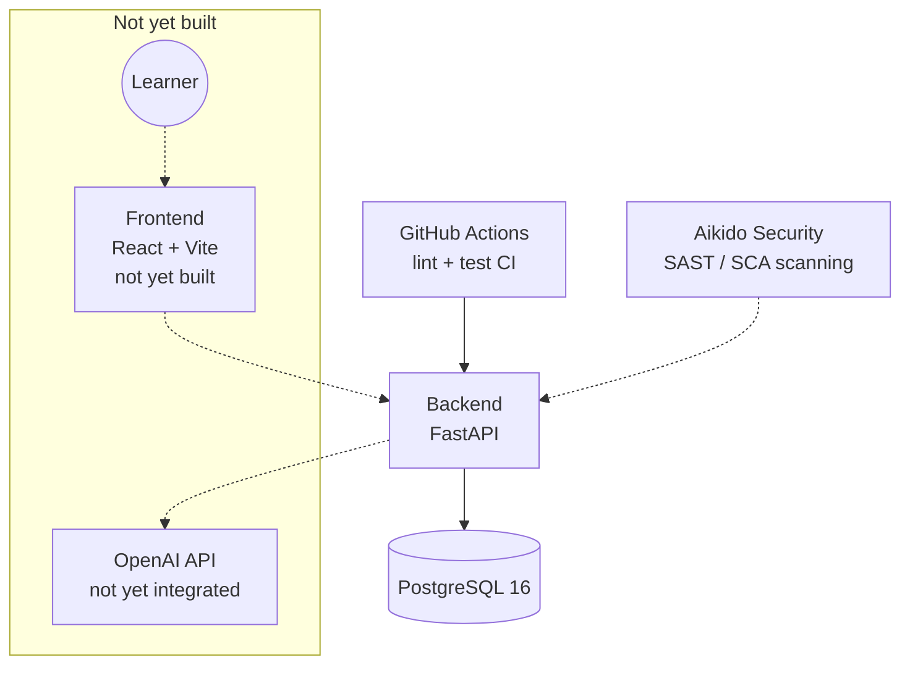

# Architecture

Current-state overview. For the reasoning behind a given decision, see [docs/adr/](adr/) — this document describes *what exists*, ADRs describe *why*.

## System overview

Dotted lines: not yet implemented, or scans the repo rather than calling it at runtime.

## Components

### Backend (`backend/`)
FastAPI app, Python 3.12. SQLAlchemy models, Alembic migrations. Currently exposes read-only endpoints for the question catalog (`/api/v1/questions`) and a health check (`/health`). See [docs/adr/0001-use-architecture-decision-records.md](adr/0001-use-architecture-decision-records.md) onward for specific decisions as they're made.

### Database
PostgreSQL 16. Local dev via `docker-compose.yml` (repo root). Production: Render managed Postgres (Frankfurt EU) — see `CLAUDE.md` for connection details and env vars.

### Deployment
Render (Frankfurt EU), provisioned as code via `render.yaml` (repo root): one web service for the backend, one managed Postgres. No frontend service yet. No staging environment — production only. See [docs/adr/0005-render-deployment-topology.md](adr/0005-render-deployment-topology.md) for the reasoning.

The deployed API currently sits behind a temporary `X-Access-Key` gate (`backend/app/core/security.py`) — not the planned JWT auth, just a stopgap while the app is live but not launched. See `CLAUDE.md` → Temporary Access Gate.

`sks-lotse.de` is the canonical domain. The three secondary/defensive domains (`sks-lotse.com`, `.global`, `.store`) are also wired to Render (free SSL) and 301-redirected to `sks-lotse.de` by `backend/app/core/canonical_domain.py`, instead of paying IONOS for SSL-enabled domain forwarding. See `CLAUDE.md` → Naming / Domain.

### Catalog import
`backend/scripts/import_catalog.py` — one-off script, parses `docs/Fragenkatalog-SKS.pdf` into the `questions` table. Not a service; run manually when the catalog changes.

### CI/CD
GitHub Actions (`.github/workflows/backend-ci.yml`): separate `lint` (ruff) and `test` (pytest, 80% coverage gate) jobs on every push to `main` and every PR.

### Security scanning
Aikido Security, connected to the GitHub repo. See `CLAUDE.md` → Development Conventions → Security Scanning for the current process and `scripts/check_aikido.sh` for querying findings directly.

## Not yet built

- Frontend (React + Vite, per `CLAUDE.md` tech stack)
- LLM grading flow (OpenAI integration)
- Auth (JWT, optional cross-device sync)
- Speech-to-text integration
- Ads (AdSense)

This section should shrink as each piece lands — keep it accurate rather than aspirational.
